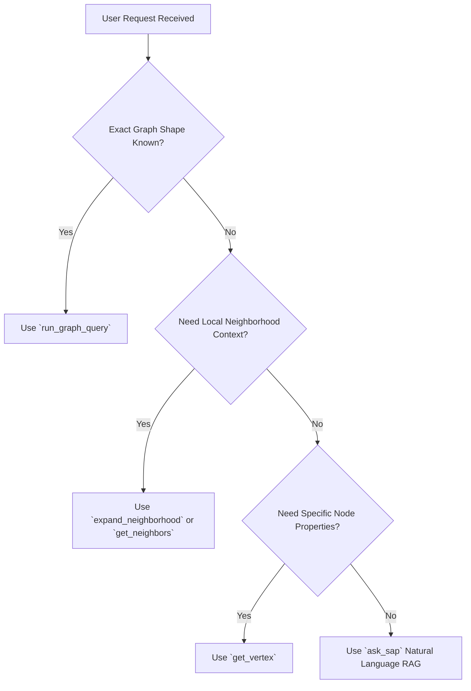

# SAPiola LLM Agent Skills & Strategy Matrix

This document defines the strategic decision matrix and operational skills for autonomous AI agents (such as Claude Desktop, Cursor, or AGY agents) interacting with the SAPiola Zero-ETL platform.

---

## Tool Selection Matrix

When deciding how to fulfill a user prompt, agents MUST apply the following routing rules:

### Routing Rules Table

| Goal / Query Type | Primary Tool | Secondary / Hydration Tool | Reason |
|---|---|---|---|
| Natural language question (e.g. "What is the status of material 123?") | `ask_sap` | `get_vertex` | Executes domain classification, RBAC filtering, and LLM context synthesis. |
| Structured graph query (e.g., `MATCH (n:salesdocument) RETURN n`) | `run_graph_query` | `get_vertex` | Fast Cypher-subset graph execution directly against the structural index. |
| Explore local connections around a hub entity | `expand_neighborhood` | `get_neighbors` | Bounded BFS traversal protected by `max_nodes_visited` circuit breaker. |
| Retrieve property details for a single ID | `get_vertex` | None | Direct $O(1)$ key lookup in Fjall LSM tree. |
| Discover schema labels and relationship types | `list_schema` | None | Instantaneous schema introspection from active DSL catalog. |
| Write new vertex or edge data | `put_vertex` / `put_edge` | None | Requires write-authorized principal (`SAPIOLA_WRITE_PRINCIPALS`). |

---

## Security & Tenant Isolation

1. **Tenant ID Propagation**: All read and write tools require `tenant_id` (or `principal`). The platform strictly isolates key namespaces at the LSM storage level (`TenantScopedKey`).
2. **Domain Authorization (RBAC)**: `ask_sap`, `put_vertex`, and `put_edge` enforce domain access checks via `SimpleRbacPolicy`. Attempting to query an unauthorized domain returns a `403 Forbidden` error.
