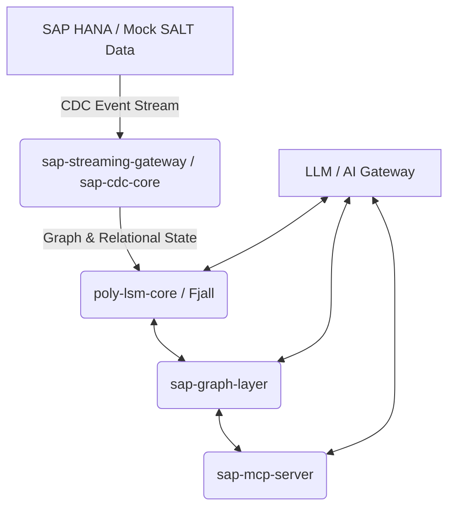

# SAPiola Zero-ETL Architecture

This document describes the end-to-end architecture of the SAPiola Zero-ETL Graph platform. SAPiola enables real-time structural graph analysis and Generative AI (RAG) directly on top of dynamic SAP HANA data without traditional ETL pipelines.

## High-Level Pipeline

The system is composed of several decoupled layers that work together to transform a linear stream of database updates into an AI-queryable knowledge graph.

## Detailed Component Breakdown

### 1. Ingestion Layer (`sap-cdc-core` & `sap-streaming-gateway`)
The ingest layer is responsible for taking raw SAP Change Data Capture (CDC) events and pushing them into our pipeline.
- **`sap-cdc-core` (Go):** Represents the original CDC agent architecture that can hook directly into SAP's SLT (SAP Landscape Transformation) replication server. It guarantees ordered delivery and exactly-once processing using an idempotency key layer.
- **`sap-streaming-gateway` (Rust):** The high-throughput dispatcher. It listens for `CdcEvent` protobuf messages (over gRPC).
- **`tools/salt_importer` (Python):** A mock generator. It uses `salt_mapping.dsl` to translate static `SALT` dataset files into identical `CdcEvent` messages, streaming them into the gateway just like a real SAP system would.

### 2. Embedded Storage Engine (`poly-lsm-core`)
Instead of bloated property graphs, SAPiola relies on **Fjall**, a Rust-based Log-Structured Merge (LSM) tree database. This single core powers both the graph structural index and the relational property store.
- **Relational State (`pivot.rs`):** Handles rapid key-value lookups. The core relational properties are stored securely on disk here.
- **Graph Topology (`engine.rs`):** Implements the `GraphStore` trait to persist node definitions and edge relationships directly in the LSM tree.
- This creates a highly optimized embedded storage layer. The structural graph stays incredibly fast because it only traverses tightly-packed adjacency keys, while the heavy relational attributes (e.g., thousands of columns per table) are retrieved via pointer indices.

### 3. Graph Engine Layer (`sap-graph-layer`)
This is the core execution engine of SAPiola.
- **`planner/cypher.pest` & `cypher_parser.rs`:** We implemented a custom Cypher-subset parser using the Rust `pest` grammar library. This compiles natural graph queries (e.g., `MATCH (n:salesdocument) RETURN n`) into logical execution plans.
- **`executor/hana.rs` & `backend.rs`:** The `RelationalBackend` trait is a crucial architectural abstraction. It executes the structural queries natively against the `poly-lsm-core`.
- **`main.rs` (gRPC Server):** Exposes `GraphServiceServer` and `StorageServiceServer`. It receives the structural edge/vertex mappings from the ingest layer and serves graph traversal requests (like bounded BFS) over gRPC.

### 4. Generative AI Layer (`sap-ai-gateway`)
A Python FastAPI application that provides a unified, hallucination-free AI interface.
- **`sapiola_ai/orchestrator.py`:** The brain of the RAG (Retrieval-Augmented Generation) pipeline. It orchestrates a complex state machine:
  1. Identifies the user query domain (e.g., `inventory`).
  2. Submits parallel searches to the graph client (`GraphClient` / gRPC).
  3. Uses the `PointerIndexClient` to hydrate those graph candidates with real Fjall relational data.
- **Security (`SimpleRbacPolicy`):** Deep defense-in-depth security. The `tenant_id` (`principal`) restricts which domains an LLM can query or write to. If a user tries to query `finance` but only has `inventory` access, it fails fast.
- **LLM Agnostic (`llm_binding.py`):** Uses the `litellm` library, which allows developers to swap between Gemini, OpenAI, Anthropic, or local open-source models with zero code changes.

### 5. AI Agent Integration Layer (`sap-mcp-server` & `sapiola-mcp`)
The Model Context Protocol (MCP) layer turns SAPiola into a plug-and-play knowledge base for any AI agent.
- **`sap-mcp-server` (Rust):** Exposes four critical tools to agents:
  - `run_graph_query`: Forward Cypher queries to the `sap-graph-layer`.
  - `ask_sap`: Forward natural language questions to the `sap-ai-gateway`.
  - `get_vertex`: Directly fetch a vertex's properties.
  - `expand_neighborhood`: Perform adversarial, circuit-breaker-protected BFS traversals directly on the graph engine.
- **`sapiola-mcp` (Node.js):** The packaging wrapper. It allows anyone to run `npm install` and connect their Claude Desktop or Cursor IDE. It includes a fallback script (`fetch-binary.js`) that will automatically compile the Rust server if a pre-built production binary is missing.

## Data Lifecycle of a CDC Event
1. **SAP HANA** triggers a record update for `SALESDOCUMENT 123`.
2. The Go CDC Agent picks up the log and streams a `CdcEvent` (Protobuf) to the Rust `sap-streaming-gateway`.
3. The gateway splits the event:
   - The *structural relationships* (e.g., `SALESDOCUMENT 123` -> `MATERIAL 456`) are sent to `sap-graph-layer` and indexed in `poly-lsm-core` via `put_edge`.
   - The *relational attributes* (e.g., `Amount: $500, Status: Pending`) are sent to `poly-lsm-core` and persisted to the Fjall LSM tree via `put_vertex`.
4. When an AI agent asks "What is the status of Sales Document 123?", the RAG orchestrator finds the node via graph traversal, retrieves the exact `$500, Pending` attributes from Fjall, and generates a flawless answer.
